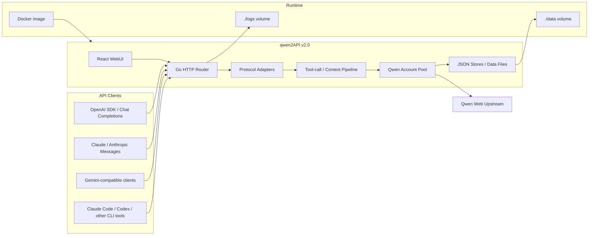

[English](README.md) | [简体中文](README_CN.md)

<div align="center">
  <a href="https://github.com/YuJunZhiXue/qwen2API">
    
  </a>

  <h1>qwen2API</h1>

  <p>
    Self-hosted Qwen Web protocol gateway with OpenAI, Anthropic, and Gemini compatible APIs.
  </p>

  <p>
    <a href="https://github.com/YuJunZhiXue/qwen2API">GitHub</a> ·
    <a href="https://hub.docker.com/r/yujunzhixue/qwen2api">Docker Hub</a> ·
    <a href="https://t.me/qwen2api">Telegram</a> ·
    <a href="./README_CN.md">中文说明</a>
  </p>

  <p>
    <a href="https://github.com/YuJunZhiXue/qwen2API/releases">
      
    </a>
    <a href="https://github.com/YuJunZhiXue/qwen2API/stargazers">
      
    </a>
    <a href="https://hub.docker.com/r/yujunzhixue/qwen2api">
      
    </a>
    
    
    
  </p>
</div>

## 一、项目简介 / Project Overview

qwen2API converts Qwen Web capabilities into common API protocols and provides a local WebUI for account management, downstream API keys, runtime settings, model tests, image tests, and video tests.

> [!NOTE]
> `v1.0` was the legacy Python + FastAPI implementation. `v2.0` is the current Go backend + React WebUI mainline and is the recommended version for Docker and local deployments.

### 1. Feature Map

| Area | Capability |
| --- | --- |
| OpenAI-compatible APIs | `/v1/chat/completions`, `/v1/responses`, `/v1/models`, `/v1/files`, `/v1/images/generations`, `/v1/videos/generations` |
| Anthropic-compatible APIs | `/v1/messages`, `/anthropic/v1/messages`, `/v1/messages/count_tokens` |
| Gemini-compatible APIs | `/v1beta/models/{model}:generateContent`, `/v1beta/models/{model}:streamGenerateContent` |
| WebUI | Accounts, API keys, runtime config, chat test, image test, video test |
| Account pool | Multi-account rotation, per-account concurrency, separate chat/image/video cooldown tracking |
| Operations | `/healthz`, `/readyz`, `/keepalive`, Docker healthcheck, multi-arch image publishing |

### 2. Version Line

| Version | Stack | Status |
| --- | --- | --- |
| `v1.0` | Python + FastAPI/Uvicorn | Legacy version, kept only as historical context |
| `v2.0` | Go backend + React WebUI | Current mainline |

## 二、快速部署 / Quick Deployment

### 1. Pull From Docker Hub

For most deployments, use the Docker Hub image directly. Keep `data` and `logs` beside your compose file; Docker will mount them into the container so upgrades do not wipe your accounts, keys, or logs.

```bash
mkdir qwen2api
cd qwen2api
mkdir -p data logs
```

Create a small `.env`:

```env
HOST_PORT=7860
HOST_DATA_DIR=./data
HOST_LOGS_DIR=./logs
ADMIN_KEY=replace-with-your-own-strong-random-key
```

Create `docker-compose.yml`:

```yaml
services:
  qwen2api:
    image: ${QWEN2API_IMAGE:-yujunzhixue/qwen2api:latest}
    container_name: qwen2api
    restart: unless-stopped
    init: true
    env_file:
      - .env
    ports:
      - "${HOST_PORT:-7860}:${PORT:-7860}"
    volumes:
      - ${HOST_DATA_DIR:-./data}:/app/data
      - ${HOST_LOGS_DIR:-./logs}:/app/logs
    shm_size: "512m"
    healthcheck:
      test: ["CMD-SHELL", "curl -fsS http://127.0.0.1:${PORT:-7860}/healthz || exit 1"]
      interval: 30s
      timeout: 10s
      start_period: 120s
      retries: 3
```

You do not need to set paths for `accounts.json`, `api_keys.json`, or other internal files. The image already uses `/app/data` and `/app/logs`; the volume mapping above decides where those files live on your host.

Start it:

```bash
docker compose pull
docker compose up -d
docker compose logs -f qwen2api
```

Open:

- WebUI: `http://127.0.0.1:7860`
- Health check: `http://127.0.0.1:7860/healthz`
- Keepalive probe: `http://127.0.0.1:7860/keepalive`

### 2. Build Locally With Docker

Use this path when you changed the source code and need to build your own image.

```bash
git clone https://github.com/YuJunZhiXue/qwen2API.git
cd qwen2API
cp .env.example .env
docker compose -f docker-compose.yml -f docker-compose.build.yml build
docker compose -f docker-compose.yml -f docker-compose.build.yml up -d
```

## 三、架构与配置 / Architecture and Configuration

### 1. Runtime Architecture



### 2. Environment Variables

Do not commit real secrets. `.env.example` intentionally contains empty values and commented examples only.

| Variable | Description |
| --- | --- |
| `ADMIN_KEY` | WebUI and `/api/admin/*` management key. Set a strong private value. |
| `QWEN_API_KEY`, `QWEN_API_KEYS`, `QWEN_API_KEY_N` | Runtime-only downstream API keys injected from env. They are not saved to `data/api_keys.json` and cannot be deleted from WebUI. |
| `QWEN_ACCOUNT_N` | Runtime-only upstream Qwen account, format `token;optional-email;optional-password`. It is not saved to `data/accounts.json`. |
| `KEEPALIVE_URL`, `KEEPALIVE_INTERVAL` | Optional background keepalive task. Env values lock the same WebUI settings. |
| `TOOL_RECOVERY_MAX_ATTEMPTS` | Maximum automatic recovery attempts when an upstream response after a tool result fails to produce the next client tool call. Default `4`, clamped to `1`-`8`. |
| `HOST_DATA_DIR`, `HOST_LOGS_DIR` | Host paths mounted into Docker as `/app/data` and `/app/logs`. Defaults are `./data` and `./logs`. |
| `DATA_DIR`, `LOGS_DIR` | Local non-Docker path overrides. Leave empty to use the current project directory. |

## 四、开发指南 / Development Guide

### 1. Requirements

- Go `1.26`
- Node.js `20+`
- npm
- Docker, only if you need container builds

### 2. One-Command Local Startup

```powershell
go run start-all.go
```

### 3. Backend Development

```powershell
cd backend
go run .
```

Verification:

```powershell
cd backend
go test ./...
go build -trimpath -ldflags="-s -w" -o ..\bin\qwen2api-backend.exe .
```

### 4. Frontend Development

```powershell
cd frontend
npm ci
npm run dev
```

Production build:

```powershell
cd frontend
npm run build
```

### 5. Development Rules

- Keep the Go backend as the `v2.0` runtime source of truth.
- Keep Docker data paths container-internal as `/app/data` and `/app/logs`.
- Control host paths through compose volume mappings instead of hard-coded workspace paths.
- Do not commit `data/`, `logs/`, `.env`, real tokens, cookies, passwords, or downstream API keys.
- Update README and `.env.example` when adding user-visible configuration.

## 五、参与贡献 / Contribution

### 1. How to Contribute

- Report bugs through [GitHub Issues](https://github.com/YuJunZhiXue/qwen2API/issues).
- Submit feature requests through [GitHub Issues](https://github.com/YuJunZhiXue/qwen2API/issues).
- Open focused pull requests through [GitHub Pull Requests](https://github.com/YuJunZhiXue/qwen2API/pulls).
- Include practical verification steps when possible.

### 2. Pull Request Checklist

- `go test ./...` passes in `backend`.
- `npm run build` passes in `frontend`.
- Docker-related changes are reflected in `Dockerfile`, `docker-compose.yml`, and README when needed.
- No generated data, logs, local `.env`, Qwen token, cookie, password, or downstream API key is included.

### 3. Contributors

Thanks to everyone who helps improve qwen2API.

[](https://github.com/YuJunZhiXue/qwen2API/graphs/contributors)

## 六、其他信息 / Other Information

### 1. Star History

[](https://www.star-history.com/#YuJunZhiXue/qwen2API&Timeline)

### 2. License

This project is released under the [GPL-3.0 License](./LICENSE).

### 3. Disclaimer

- This project is provided as an open-source self-hosted gateway.
- Review your local laws, platform rules, and upstream account policies before deployment.
- Do not publish or share real account tokens, cookies, passwords, or downstream API keys.
- If you find a security issue, please avoid public secret disclosure and report it through a private channel first.

### 4. Acknowledgements

- 特别鸣谢: [LinuxDo](https://linux.do/)

---

<div align="center">
  <p>If qwen2API helps you, consider giving the project a Star.</p>
  <p>Made by <a href="https://github.com/YuJunZhiXue">YuJunZhiXue</a> and contributors.</p>
</div>
