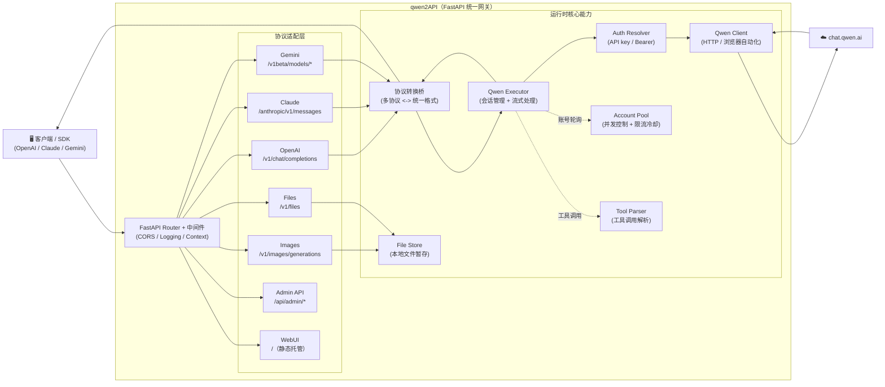

# qwen2API Enterprise Gateway

[](https://github.com/YuJunZhiXue/qwen2API/blob/main/LICENSE)
[](https://github.com/YuJunZhiXue/qwen2API/stargazers)
[](https://github.com/YuJunZhiXue/qwen2API/network/members)
[](https://github.com/YuJunZhiXue/qwen2API/releases)
[](https://hub.docker.com/r/yujunzhixue/qwen2api)

[](https://zeabur.com/templates/qwen2api)
[](https://vercel.com/new/clone?repository-url=https%3A%2F%2Fgithub.com%2FYuJunZhiXue%2Fqwen2API)

语言 / Language: [中文](./README.md) | [English](./README.en.md)

qwen2api 用于将通义千问（chat.qwen.ai）网页版能力转换为 OpenAI、Anthropic Claude 与 Gemini 兼容接口。项目后端基于 FastAPI，前端基于 React + Vite，内置管理台、账号池、工具调用解析、图片生成链路与多种部署方式。

---

## 目录

- [项目说明](#项目说明)
- [架构概览](#架构概览)
- [核心能力](#核心能力)
- [接口支持](#接口支持)
- [模型映射](#模型映射)
- [图片生成](#图片生成)
- [快速开始](#快速开始)
  - [方式一：Docker 直接运行预构建镜像（推荐）](#方式一docker-直接运行预构建镜像推荐)
  - [方式二：本地源码运行](#方式二本地源码运行)
- [环境变量说明（.env）](#环境变量说明env)
- [docker-compose.yml 说明](#docker-composeyml-说明)
- [端口说明](#端口说明)
- [WebUI 管理台](#webui-管理台)
- [数据持久化](#数据持久化)
- [项目目录结构](#项目目录结构)
- [高级特性与内部机制](#高级特性与内部机制)
- [性能优化与稳定性](#性能优化与稳定性)
- [客户端接入示例](#客户端接入示例)
- [常见问题](#常见问题)
- [故障排查速查表](#故障排查速查表)
- [开发指南](#开发指南)
- [变更日志与路线图](#变更日志与路线图)
- [许可证与免责声明](#许可证与免责声明)

---

## 项目说明

本项目提供以下能力：

1. 将千问网页对话能力转换为 OpenAI Chat Completions 接口。
2. 将千问网页对话能力转换为 Anthropic Messages 接口。
3. 将千问网页对话能力转换为 Gemini GenerateContent 接口。
4. 提供独立的图片生成接口 `POST /v1/images/generations`。
5. 支持工具调用（Tool Calling）与工具结果回传。
6. 提供管理台，用于账号管理、API Key 管理、图片生成测试与运行状态查看。
7. 提供多账号轮询、限流冷却、重试与浏览器 / httpx 混合引擎。

---

## 架构概览



**架构说明**：

- **后端**：Python FastAPI（`backend/`），统一处理多协议适配与上游调用
- **前端**：React 管理台（`frontend/`），运行时托管静态构建产物
- **部署**：Docker（推荐）、本地运行、Vercel、Zeabur

**核心特性**：

- **统一路由内核**：所有协议入口统一汇聚到 FastAPI Router，避免多入口行为漂移
- **协议转换桥**：Claude / Gemini 入口先转换为统一格式，再调用上游，最后转换回原协议响应
- **工具调用支持**：支持 OpenAI / Claude / Gemini 三种工具调用格式，自动解析与转换
- **账号池管理**：多账号轮询、并发控制、限流冷却、自动重试
- **文件附件**：支持文件上传、本地暂存、上下文注入
- **图片生成**：独立图片生成接口，支持多种尺寸比例

---

## 核心能力

- OpenAI / Anthropic / Gemini 三套接口兼容。
- 工具调用解析与工具结果回传。
- Browser Engine、Httpx Engine、Hybrid Engine 三种执行模式。
- 多账号并发池、动态冷却、故障重试。
- 基于千问网页真实工具链路的图片生成。
- WebUI 管理台。
- 健康检查与就绪检查接口。
- **Chat ID 预热池**：后台预建会话队列，单次请求节省 500ms~3s 握手耗时。
- **Schema 压缩**：JSON Schema → TypeScript-like 签名，tool prompt 节省 ~90% 空间。
- **工具名混淆**：客户端工具名自动加 `u_` 前缀或别名，避免 Qwen 内置函数校验拦截。
- **工具调用幻觉防护**：auto_agent_blocked、重复调用拦截、空响应重试、毒性拒绝识别。
- **截断自动续写**：`##TOOL_CALL##` 未闭合时自动续写并去重拼接。
- **文件内容缓存**：代理侧缓存 Claude Code 的"Unchanged since last read"真实内容。
- **历史拒绝清洗**：扫描历史 assistant 消息中的拒绝/自限文本，防止级联复现。
- **增量流式 warmup**：累积 96 字符再吐出，期间过滤道歉前缀和不完整工具调用。
- **话题隔离**：检测 user 消息的实体 Jaccard 相似度，判定新任务时自动丢弃无关历史。
- **工具少样本注入**：按命名空间挑代表工具构造合成 few-shot，提高 MCP / Skill 类工具命中率。
- **Edit/StrReplace 模糊匹配**：自动修复智能引号、空白、反斜杠差异导致的 exact match 失败。
- **CLIProxy 协议转换层**：多协议入口统一落到 `StandardRequest`，避免多入口行为漂移。

---

## 接口支持

| 接口类型 | 路径 | 说明 |
|---|---|---|
| OpenAI Chat | `POST /v1/chat/completions` | 支持流式与非流式、工具调用、图片意图自动识别 |
| OpenAI Models | `GET /v1/models` | 返回可用模型别名 |
| OpenAI Images | `POST /v1/images/generations` | 图片生成接口 |
| Anthropic Messages | `POST /anthropic/v1/messages` | Claude / Anthropic SDK 兼容 |
| Gemini GenerateContent | `POST /v1beta/models/{model}:generateContent` | Gemini SDK 兼容 |
| Gemini Stream | `POST /v1beta/models/{model}:streamGenerateContent` | 流式输出 |
| Admin API | `/api/admin/*` | 管理接口 |
| Health | `/healthz` | 存活探针 |
| Ready | `/readyz` | 就绪探针 |

---

## 模型映射

当前默认将主流客户端模型名称统一映射至 `qwen3.6-plus`。

| 传入模型名 | 实际调用 |
|---|---|
| `gpt-4o` / `gpt-4-turbo` / `gpt-4.1` / `o1` / `o3` | `qwen3.6-plus` |
| `gpt-4o-mini` / `gpt-3.5-turbo` | `qwen3.6-plus` |
| `claude-opus-4-6` / `claude-sonnet-4-6` / `claude-3-5-sonnet` | `qwen3.6-plus` |
| `claude-3-haiku` / `claude-haiku-4-5` | `qwen3.6-plus` |
| `gemini-2.5-pro` / `gemini-2.5-flash` / `gemini-1.5-pro` | `qwen3.6-plus` |
| `deepseek-chat` / `deepseek-reasoner` | `qwen3.6-plus` |

未命中映射表时，默认回退为传入模型名本身；若管理台设置了自定义映射规则，则以配置为准。

---

## 图片生成

qwen2API 提供与 OpenAI Images 接口兼容的图片生成能力。

- 接口：`POST /v1/images/generations`
- 默认模型别名：`dall-e-3`
- 实际底层：`qwen3.6-plus` + 千问网页 `image_gen` 工具
- 返回图片链接域名：通常为 `cdn.qwenlm.ai`

### 请求示例

```bash
curl http://127.0.0.1:7860/v1/images/generations \
  -H "Content-Type: application/json" \
  -H "Authorization: Bearer YOUR_API_KEY" \
  -d '{
    "model": "dall-e-3",
    "prompt": "一只赛博朋克风格的猫，霓虹灯背景，超写实",
    "n": 1,
    "size": "1024x1024",
    "response_format": "url"
  }'
```

### 返回示例

```json
{
  "created": 1712345678,
  "data": [
    {
      "url": "https://cdn.qwenlm.ai/output/.../image.png?key=...",
      "revised_prompt": "一只赛博朋克风格的猫，霓虹灯背景，超写实"
    }
  ]
}
```

### 支持的图片比例

前端图片生成页面内置以下比例：

- `1:1`
- `16:9`
- `9:16`
- `4:3`
- `3:4`

### Chat 接口图片意图识别

`/v1/chat/completions` 支持根据用户消息自动识别图片生成意图。例如：

- “帮我画一张……”
- “生成一张图片……”
- “draw an image of ……”

当识别为图片生成请求时，系统会自动切换到图片生成管道。

---

## 快速开始

### 方式一：Docker 直接运行预构建镜像（推荐）

此方式适用于生产环境、测试服务器与普通部署场景。  
优点是：**不需要本地编译前端，不需要在服务器构建镜像，不需要服务器自行下载 Camoufox。**

#### 第一步：准备目录

```bash
mkdir qwen2api && cd qwen2api
mkdir -p data logs
```

#### 第二步：创建 `docker-compose.yml`

```yaml
services:
  qwen2api:
    image: yujunzhixue/qwen2api:latest
    container_name: qwen2api
    restart: unless-stopped
    env_file:
      - path: .env
        required: false
    ports:
      - "7860:7860"
    volumes:
      - ./data:/workspace/data
      - ./logs:/workspace/logs
    shm_size: '256m'
    environment:
      PYTHONIOENCODING: utf-8
      PORT: "7860"
      ENGINE_MODE: "hybrid"
    healthcheck:
      test: ["CMD", "curl", "-f", "http://localhost:7860/healthz"]
      interval: 30s
      timeout: 10s
      start_period: 120s
      retries: 3
```

#### 第三步：创建 `.env`（可选但推荐）

建议至少写入以下内容：

```env
# ========== 必须修改 ==========
ADMIN_KEY=change-me-now              # 管理台登录密钥，必须修改为强密码！

# ========== 基础配置 ==========
PORT=7860                            # 服务监听端口
WORKERS=1                            # Uvicorn worker 数量，必须保持 1（多 worker 会导致 JSON 文件冲突）
LOG_LEVEL=INFO                       # 日志级别：DEBUG/INFO/WARNING/ERROR

# ========== 并发控制 ==========
MAX_INFLIGHT=1                       # 每账号最大并发请求数（账号多时可改为 2）
MAX_RETRIES=3                        # 请求失败最大重试次数（网络不稳定时增加到 5）

# ========== 限流冷却 ==========
ACCOUNT_MIN_INTERVAL_MS=1200         # 同账号两次请求最小间隔（毫秒），被限流时启用
REQUEST_JITTER_MIN_MS=120            # 请求前随机抖动最小值（毫秒）
REQUEST_JITTER_MAX_MS=360            # 请求前随机抖动最大值（毫秒）
RATE_LIMIT_BASE_COOLDOWN=600         # 限流基础冷却时间（秒），频繁限流时增加到 1200
RATE_LIMIT_MAX_COOLDOWN=3600         # 限流最大冷却时间（秒）

# ========== 数据文件路径（Docker 部署通常不需要改）==========
ACCOUNTS_FILE=/workspace/data/accounts.json
USERS_FILE=/workspace/data/users.json
CONTEXT_CACHE_FILE=/workspace/data/context_cache.json
UPLOADED_FILES_FILE=/workspace/data/uploaded_files.json
```

**环境变量详细说明**：

| 变量 | 默认值 | 说明 | 何时修改 |
|------|--------|------|----------|
| `ADMIN_KEY` | `admin` | 管理台登录密钥 | **必须修改**为强密码 |
| `PORT` | `7860` | 服务监听端口 | 端口冲突时修改 |
| `WORKERS` | `1` | Uvicorn worker 数量 | **必须保持 1**，多 worker 会导致数据冲突 |
| `LOG_LEVEL` | `INFO` | 日志级别 | 调试时改为 `DEBUG`，生产环境改为 `WARNING` |
| `MAX_INFLIGHT` | `1` | 每账号最大并发数 | 账号多且稳定时可改为 `2` |
| `MAX_RETRIES` | `3` | 请求失败重试次数 | 网络不稳定时增加到 `5` |
| `ACCOUNT_MIN_INTERVAL_MS` | `0` | 同账号请求间隔（毫秒） | 被限流时改为 `1200` |
| `REQUEST_JITTER_MIN_MS` | `0` | 请求抖动最小值 | 模拟真实用户行为时设置 `120` |
| `REQUEST_JITTER_MAX_MS` | `0` | 请求抖动最大值 | 模拟真实用户行为时设置 `360` |
| `RATE_LIMIT_BASE_COOLDOWN` | `600` | 限流冷却时间（秒） | 频繁限流时增加到 `1200` |

**docker-compose.yml 配置说明**：

| 配置项 | 说明 | 建议修改 |
|--------|------|----------|
| `image` | 预构建镜像地址，支持 amd64/arm64 | 保持默认 `yujunzhixue/qwen2api:latest` |
| `ports` | 端口映射，格式：`宿主机端口:容器端口` | 如 7860 被占用，改为 `"8080:7860"` |
| `volumes` | 数据持久化挂载 | **必须保留**，否则重启后数据丢失 |
| `shm_size` | 浏览器共享内存 | 浏览器崩溃时改为 `"512m"` |
| `environment.PORT` | 容器内服务端口 | 通常不需要改 |
| `healthcheck` | 健康检查配置 | 保持默认即可 |

#### 第四步：启动服务

```bash
docker compose up -d
```

#### 第五步：查看状态

```bash
docker compose ps
docker compose logs -f
curl http://127.0.0.1:7860/healthz
```

#### 第六步：更新服务

```bash
docker compose pull
docker compose up -d
```

---

## 跨平台（amd64/arm64）部署说明

你在 Mac（Apple Silicon, arm64）上 `docker build` 默认会产出 `linux/arm64` 镜像；
如果把这个单架构镜像推到仓库，Linux x86_64 服务器（`linux/amd64`）拉取后会报：

`The requested image's platform (linux/arm64/v8) does not match the detected host platform (linux/amd64/...)`

正确做法是发布 **多架构镜像（manifest list）**，同时包含 `linux/amd64` 与 `linux/arm64`。

### 方案 A：用 GitHub Actions 自动发布多架构镜像（推荐）

本仓库已在 [docker-publish.yml](file:///Users/hongyan/work/workspace/todo/ai/qwen2API/.github/workflows/docker-publish.yml) 配置 `platforms: linux/amd64,linux/arm64`。
你只需要把修复推到你自己的仓库并设置 DockerHub secrets，然后在服务器端执行：

```bash
docker compose pull
docker compose up -d
```

### 方案 B：本地 buildx 推多架构镜像（适合无 CI 的场景）

```bash
# 1) 登录镜像仓库（DockerHub/ACR/GHCR 任意）
docker login

# 2) 构建并推送多架构镜像
./scripts/buildx-push.sh <你的仓库名>/qwen2api:<tag>
```

服务器端仍然只需要 `docker compose pull && docker compose up -d`。

### 关于 docker-compose 文件

生产部署（Linux/Windows）建议使用拉镜像模式：

- `docker-compose.yml`：默认 `image: yujunzhixue/qwen2api:latest`（或通过 `QWEN2API_IMAGE` 覆盖）
- `docker-compose.build.yml`：仅用于本地从源码构建（开发/调试）

---

### 方式二：本地源码运行

此方式适用于本地开发与调试。

#### 环境要求

- Python 3.12+
- Node.js 20+
- 可访问 Camoufox 下载源

#### 步骤

```bash
git clone https://github.com/YuJunZhiXue/qwen2API.git
cd qwen2API
python start.py
```

`python start.py` 会自动完成以下工作：

1. 安装后端依赖
2. 下载 Camoufox 浏览器内核
3. 安装前端依赖
4. 构建前端
5. 启动后端服务

---

## 环境变量说明（.env）

项目提供 `.env.example` 作为模板。以下为主要参数说明。

### 基础参数

| 参数 | 默认值 | 说明 |
|---|---|---|
| `ADMIN_KEY` | `change-me-now` / `admin` | 管理台管理员密钥。建议部署后立即修改。 |
| `PORT` | `7860` | 后端服务监听端口。 |
| `WORKERS` | `1` 或 `3` | Uvicorn worker 数量。单实例环境建议 1。 |
| `REGISTER_SECRET` | 空 | 用户注册密钥。为空时表示不限制注册。 |

### 引擎参数

| 参数 | 默认值 | 说明 |
|---|---|---|
| `ENGINE_MODE` | `hybrid` | 引擎模式。可选 `hybrid`、`httpx`、`browser`。 |
| `BROWSER_POOL_SIZE` | `2` | 浏览器页面池大小。值越大并发越高，但内存占用也越高。 |
| `STREAM_KEEPALIVE_INTERVAL` | `5` | 流式输出 keepalive 间隔。 |

#### `ENGINE_MODE` 说明

- `hybrid`：推荐模式。聊天、建会话、删会话优先走浏览器；httpx 作为故障兜底。
- `httpx`：全部优先走 httpx / curl_cffi。速度更快，但浏览器特征更弱，适合对速度优先的测试场景。
- `browser`：全部走浏览器。更接近真实网页环境，但资源占用更高。

如果需要在 `httpx` 和 `hybrid` 之间切换，只需修改：

```env
ENGINE_MODE=httpx
```

或：

```env
ENGINE_MODE=hybrid
```

修改后重启服务：

```bash
docker compose restart
```

### 并发与风控参数

| 参数 | 默认值 | 说明 |
|---|---|---|
| `MAX_INFLIGHT` | `1` | 每个账号允许的最大并发请求数。 |
| `ACCOUNT_MIN_INTERVAL_MS` | `1200` | 同一账号两次请求之间的最小间隔。 |
| `REQUEST_JITTER_MIN_MS` | `120` | 随机抖动最小值。 |
| `REQUEST_JITTER_MAX_MS` | `360` | 随机抖动最大值。 |
| `MAX_RETRIES` | `2` | 请求失败最大重试次数。 |
| `TOOL_MAX_RETRIES` | `2` | 工具调用相关最大重试次数。 |
| `EMPTY_RESPONSE_RETRIES` | `1` | 空响应最大重试次数。 |
| `RATE_LIMIT_BASE_COOLDOWN` | `600` | 账号限流基础冷却时间（秒）。 |
| `RATE_LIMIT_MAX_COOLDOWN` | `3600` | 账号限流最大冷却时间（秒）。 |

### 数据路径参数

| 参数 | 默认值 | 说明 |
|---|---|---|
| `ACCOUNTS_FILE` | `/workspace/data/accounts.json` | 账号数据文件路径。 |
| `USERS_FILE` | `/workspace/data/users.json` | API Key / 用户数据文件路径。 |
| `CAPTURES_FILE` | `/workspace/data/captures.json` | 抓取结果文件路径。 |
| `CONFIG_FILE` | `/workspace/data/config.json` | 运行时配置文件路径。 |

---

## docker-compose.yml 说明

以下是推荐的 Compose 配置：

```yaml
services:
  qwen2api:
    image: yujunzhixue/qwen2api:latest
    container_name: qwen2api
    restart: unless-stopped
    env_file:
      - path: .env
        required: false
    ports:
      - "7860:7860"
    volumes:
      - ./data:/workspace/data
      - ./logs:/workspace/logs
    shm_size: '256m'
    environment:
      PYTHONIOENCODING: utf-8
      PORT: "7860"
      ENGINE_MODE: "hybrid"
    healthcheck:
      test: ["CMD", "curl", "-f", "http://localhost:7860/healthz"]
      interval: 30s
      timeout: 10s
      start_period: 120s
      retries: 3
```

### 字段说明

| 字段 | 说明 |
|---|---|
| `image` | 预构建镜像地址。普通部署推荐使用。 |
| `container_name` | 容器名称。 |
| `restart` | 开机或故障时自动重启。 |
| `env_file` | 从 `.env` 加载环境变量。 |
| `ports` | 将宿主机端口映射到容器端口。 |
| `volumes` | 持久化数据与日志目录。 |
| `shm_size` | 浏览器共享内存。Camoufox / Firefox 运行建议至少 256m。 |
| `environment` | Compose 中直接写入的环境变量，优先级高于镜像默认值。 |
| `healthcheck` | 容器健康检查。 |

### 用户需要修改的部分

通常只需要根据部署环境修改以下内容：

1. **端口映射**
   ```yaml
   ports:
     - "7860:7860"
   ```
   如果服务器 7860 已占用，可以改为：
   ```yaml
   ports:
     - "8080:7860"
   ```

2. **引擎模式**
   ```yaml
   environment:
     ENGINE_MODE: "hybrid"
   ```
   可改为：
   ```yaml
   environment:
     ENGINE_MODE: "httpx"
   ```

3. **共享内存**
   ```yaml
   shm_size: '256m'
   ```
   如果浏览器容易崩溃，可改为：
   ```yaml
   shm_size: '512m'
   ```

4. **数据挂载目录**
   ```yaml
   volumes:
     - ./data:/workspace/data
     - ./logs:/workspace/logs
   ```
   如需自定义存储路径，可替换左侧宿主机目录。

---

## 端口说明

### 为什么 Docker 部署前后端在同一个端口

Docker 镜像中已经构建好前端静态文件，并由后端统一托管：

- 后端 API：`http://host:7860/*`
- 前端管理台：`http://host:7860/`

因此 **Docker 部署时默认只有一个端口 7860**。

### 为什么本地开发时可能不是同一个端口

本地开发通常有两种方式：

1. **使用 `python start.py`**  
   前端会先构建为静态文件，再由后端统一托管。此时通常仍是一个端口。

2. **使用前端 Vite 开发服务器单独运行**  
   例如：
   - 前端：`http://localhost:5173`
   - 后端：`http://localhost:7860`

这种模式仅用于前端开发调试，不是生产部署模式。

---

## WebUI 管理台

管理台默认由后端托管，入口为：

```text
http://127.0.0.1:7860/
```

主要页面包括：

| 页面 | 说明 |
|---|---|
| 运行状态 | 查看整体服务状态、引擎状态与统计信息 |
| 账号管理 | 添加、测试、禁用、查看上游账号状态 |
| API Key | 管理下游调用密钥 |
| 接口测试 | 直接测试 OpenAI 对话接口 |
| 图片生成 | 图形化图片生成页面 |
| 系统设置 | 查看并修改部分运行时参数 |

---

## 数据持久化

默认数据目录：

- `data/accounts.json`：上游账号信息
- `data/users.json`：下游 API Key / 用户数据
- `data/captures.json`：抓取结果
- `data/config.json`：运行时配置
- `logs/`：运行日志

生产环境请务必持久化 `data/` 与 `logs/`。

---

## 项目目录结构

```text
qwen2API/
├── backend/                        # Python FastAPI 后端
│   ├── main.py                     # 应用入口，注册路由 / 中间件 / 生命周期
│   ├── api/                        # 协议入口层
│   │   ├── chat.py                 # OpenAI Chat Completions
│   │   ├── anthropic.py            # Anthropic Messages
│   │   ├── gemini.py               # Gemini GenerateContent
│   │   ├── images.py               # 图片生成
│   │   ├── files.py                # 文件上传 / 管理
│   │   ├── admin.py                # 管理 API
│   │   └── models.py               # 模型别名
│   ├── adapter/
│   │   ├── cli_proxy.py            # 多协议 → StandardRequest 转换代理
│   │   └── standard_request.py     # 统一请求结构 + 客户端 profile
│   ├── core/
│   │   ├── config.py               # 全局配置 / 模型映射
│   │   ├── request_logging.py      # 请求上下文 + 链路日志
│   │   ├── auth.py                 # API Key / Bearer 鉴权
│   │   └── account_pool/           # 账号池（已拆分为子模块）
│   │       ├── pool_core.py        # 池状态 / 冷却 / 淘汰
│   │       └── pool_acquire.py     # 账号获取 / 并发控制
│   ├── runtime/
│   │   ├── execution.py            # 流式执行 + 重试指令
│   │   └── stream_metrics.py       # 流式指标埋点
│   ├── services/                   # 稳定性 / 格式转换 / 兼容层
│   │   ├── qwen_client.py          # HTTP + 浏览器双引擎
│   │   ├── prompt_builder.py       # 消息 → prompt + tools 装配
│   │   ├── tool_parser.py          # ##TOOL_CALL## 文本协议解析
│   │   ├── tool_validator.py       # 工具入参校验
│   │   ├── tool_arg_fixer.py       # 智能引号 / 模糊 Edit 修复
│   │   ├── tool_few_shot.py        # 按命名空间注入少样本
│   │   ├── tool_name_obfuscation.py# 工具名混淆避免 Qwen 函数校验
│   │   ├── schema_compressor.py    # JSON Schema → TS-like 签名
│   │   ├── chat_id_pool.py         # chat_id 预热池
│   │   ├── file_content_cache.py   # Read 结果缓存
│   │   ├── incremental_text_streamer.py # 流式 warmup / guard
│   │   ├── refusal_cleaner.py      # 历史拒绝文本清洗
│   │   ├── topic_isolation.py      # 新任务检测 / 历史切分
│   │   ├── truncation_recovery.py  # ##TOOL_CALL## 截断续写
│   │   ├── openai_stream_translator.py # 文本协议 → OpenAI SSE
│   │   ├── context_attachment_manager.py # 长上下文 → 附件
│   │   ├── context_offload.py      # 上下文卸载策略
│   │   ├── context_cleanup.py      # TTL 清理
│   │   ├── auth_resolver.py        # API Key → 上游账号
│   │   ├── auth_quota.py           # 下游 Key 配额
│   │   ├── completion_bridge.py    # 多协议响应桥
│   │   ├── file_store.py           # 本地文件暂存
│   │   ├── upstream_file_uploader.py # 文件上传至千问
│   │   ├── garbage_collector.py    # 会话 / 临时文件 GC
│   │   ├── response_formatters.py  # 各协议响应格式化
│   │   ├── standard_request_builder.py
│   │   ├── attachment_preprocessor.py
│   │   ├── task_session.py
│   │   └── token_calc.py
│   ├── toolcall/
│   │   ├── normalize.py            # 工具名规范化
│   │   ├── stream_state.py         # 流式工具调用状态机
│   │   └── formats_json.py         # JSON 工具格式
│   ├── upstream/
│   │   └── qwen_executor.py        # 会话生命周期 + 流式分发
│   └── data/                       # 运行期可写目录（accounts/users/config/...）
├── frontend/                       # React + Vite 管理台
│   ├── src/
│   │   ├── pages/                  # Dashboard / Settings / Test / Images
│   │   ├── layouts/
│   │   └── components/
│   └── vite.config.ts
├── docker-compose.yml
├── Dockerfile
├── start.py                        # 一键启动（装依赖 + 下浏览器 + 构建前端）
├── requirements.txt
├── .env.example
└── README.md
```

---

## 高级特性与内部机制

以下是 qwen2API 为了在"千问网页对话"这条弱约束上游上跑稳定工具调用而引入的内部模块。普通使用者可以忽略；希望深度定制或贡献代码时可参考。

### Chat ID 预热池（`chat_id_pool.py`）

- **动机**：`/api/v2/chats/new` 握手耗时在健康时 500ms，抖动时可达 5~6s。
- **做法**：服务启动后为每个可用账号预建 `target_per_account` 个 `chat_id`，请求到来直接 pop；用掉一个后台立即补位。
- **TTL**：单条 `chat_id` 默认 30 分钟过期，过期则丢弃重建。
- **兜底**：取不到预热 chat_id 时 fallback 到同步 `create_chat`。

### Schema 压缩（`schema_compressor.py`）

把 JSON Schema 压缩成 TS-like 签名：

```
输入：{"type":"object","properties":{
         "file_path":{"type":"string"},
         "encoding":{"type":"string","enum":["utf-8","base64"]}},
       "required":["file_path"]}

输出：{file_path!: string, encoding?: utf-8|base64}
```

- 单工具定义从 ~1.5KB 降到 ~150~250 bytes。90 个工具 ~135KB → ~15KB。
- 输入越小，上游输出预算越多，截断率越低。

### 工具名混淆（`tool_name_obfuscation.py`）

Qwen 上游会把常见短名（Read/Write/Bash/Edit…）当内置函数校验并返回"Tool X does not exists."。

- **显式别名**：`Read→fs_open_file`、`Bash→shell_run`、`Grep→text_search` 等。
- **通用兜底**：其余客户端工具自动加 `u_` 前缀，如 `TaskCreate→u_TaskCreate`、`mcp__playwright__click→u_mcp__playwright__click`。
- 出站（发往 Qwen）自动转换；入站（Qwen 返回）反向还原给客户端。

### 工具调用少样本（`tool_few_shot.py`）

- **问题**：有 90+ 工具（含 MCP / Skills / Plugin 多命名空间）时，Qwen 倾向于只调用几个"熟悉"的核心工具，MCP / Skill 几乎不被主动使用。
- **做法**：按命名空间分组挑一个代表工具，构造一条合成的 `[user → assistant]` 对话，assistant 示范**多种类型工具同时被调用**（1 个核心 + 最多 4 个第三方代表）。
- **效果**：模型看到"assistant 在第一步就用了 5 种不同类型的工具"，会复现这种多样性。

### 工具调用截断续写（`truncation_recovery.py`）

- 检测：`##TOOL_CALL##` 开标签数 > `##END_CALL##` 闭标签数 → 说明某个 action block 尚未闭合。
- 续写：丢弃全部工具定义和历史（省 token），只保留末尾 2000 字节作为 anchor，在 assistant 角色塞入 anchor + user "请从中断点继续，不要重复"。
- 去重：`deduplicateContinuation` 去掉与已有末尾的重叠；最多续写 `MAX_AUTO_CONTINUE` 次。

### 文件内容缓存（`file_content_cache.py`）

Claude Code 客户端对同一文件重复 Read 时，不重发完整内容，只发一句 "File unchanged since last read" 提示语。但 qwen2API 每次请求都新建 Qwen chat，Qwen 完全没历史，提示语毫无意义。

- 在代理侧按 `(api_key, file_path)` 保留最近一次真实 Read 结果
- 检测到提示语时用缓存回填
- 内存 LRU，最多 200 条，每条 TTL 15 分钟，按 API KEY 做 session 隔离

### 历史拒绝清洗（`refusal_cleaner.py`）

扫描过往 assistant 消息里的拒绝 / 自我限制文本（"I'm sorry, I cannot help..."、"我只能回答编程相关问题"、"Tool X does not exist"），命中后把整条消息内容替换为占位工具调用，防止模型看到自己的拒绝模式并级联复现。

### 增量流式 warmup（`incremental_text_streamer.py`）

- **warmup**：累积 96 字符再开始输出。期间可做拒绝检测 / 格式判断。
- **guard**：任何时候输出到客户端时都保留末尾 256 字符暂不输出，给跨 chunk 检测留空间（例如识别 `##TOOL_CALL##` 开始标记）。
- **finish()**：结束时把剩余全部补齐。

### 话题隔离（`topic_isolation.py`）

- 抽取每条 user 消息的**关键实体**：文件路径、URL、专名 / 引号字符串 / 驼峰标识符。
- 计算最新 user 消息实体集 vs 历史 first user 实体集的 **Jaccard 相似度**。
- 当最新 user 有自己的非空实体集且 Jaccard < 0.1 → 判定为新任务 → 调用方丢弃历史。
- 避免用户从"读文件"转到"浏览器注册"时，旧工具调用历史误导模型。

### 工具参数模糊修复（`tool_arg_fixer.py`）

- **smart quote 替换**：`" " ' '` → ASCII `" '`。
- **Edit / StrReplace 模糊匹配**：old_string 不 exact match 时，构造 fuzzy 正则（容忍引号 / 空白 / 反斜杠）在文件里搜，唯一命中则用真实文本替换 args 里的 old_string。

### 账号池子模块化（`core/account_pool/`）

原先的 `account_pool.py` 已拆分：

- `pool_core.py`：池状态 / 冷却 / 淘汰策略
- `pool_acquire.py`：并发控制 + 账号获取（MAX_INFLIGHT + MIN_INTERVAL + jitter）

老文件 `account_pool_old.py` 保留仅作参考，不再引用。

### CLIProxy 协议转换层（`adapter/cli_proxy.py`）

多协议入口（OpenAI / Claude / Gemini）统一通过 `CLIProxy.from_openai` / `from_anthropic` / `from_gemini` 落到 `StandardRequest`，避免三个入口各自维护 prompt 组装 / tool 装配 / client_profile 判定逻辑导致行为漂移。

### 运行期重试指令（`runtime/execution.py`）

集中式重试决策，支持以下触发原因：

| 原因 | 条件 | 处理 |
|---|---|---|
| `blocked_tool_name` | 命中已知被 Qwen 校验拦截的工具名 | 注入格式提醒 |
| `invalid_textual_tool_contract` | `##TOOL_CALL##` 格式错误 | 注入格式示例 |
| `repeated_same_tool` | 相同工具 + 相同参数重复调用 | 注入反复调用禁令 |
| `unchanged_read_result` | 刚收到 "Unchanged since last read" 又要 Read 同一文件 | 强制换工具 |
| `auto_agent_blocked` | 用户未提及 agent 却自动调 Agent | 强制不调 Agent |
| `search_no_results` | 上次 WebSearch 无结果又搜同样词 | 强制换工具 |
| `empty_upstream_response` | 上游返回空 | 换账号 + 换 chat_id 重试 |
| `toxic_refusal_early` | 流式早期识别到拒绝/幻觉 | 提前拦截 + 重试 |

---

## 性能优化与稳定性

### Hybrid 流式模式

工具调用采用缓冲模式（10~30s 等完整解析），纯文本采用实时流式（首 token ~5s）。既避免流式中途吐出不完整 `##TOOL_CALL##` 被客户端解析失败，又保证聊天场景的首 token 响应速度。

### 浏览器优先路由

生产部署默认 `ENGINE_MODE=hybrid`：

- **聊天 / 建会话 / 删会话**：优先走浏览器（Camoufox），拟态更高，限流风险低。
- **故障兜底**：浏览器失败时自动降级到 httpx / curl_cffi。
- 避免全 httpx 方案的账号封禁风险。

### 预热与池化

| 池 | 作用 | 命中后节省 |
|---|---|---|
| 账号池 | 多账号轮询 | 一次请求 0 握手 |
| Chat ID 预热池 | 预建会话 | 500ms~6s |
| 浏览器页面池 | 预开 Camoufox 页面 | 浏览器冷启动 3~10s |

### 限流冷却策略

账号命中 429 / 风控时：

- **基础冷却**：`RATE_LIMIT_BASE_COOLDOWN`（默认 600s）
- **指数退避**：连续触发冷却时翻倍，上限 `RATE_LIMIT_MAX_COOLDOWN`（默认 3600s）
- **冷却期自动跳过**：池获取账号时自动过滤冷却中的账号

### 请求抖动

`REQUEST_JITTER_MIN_MS` / `REQUEST_JITTER_MAX_MS` 会在每次请求前引入随机延迟，避免成百上千个请求在同一时刻打到上游导致同时限流。

---

## 客户端接入示例

### OpenAI Python SDK

```python
from openai import OpenAI

client = OpenAI(
    base_url="http://127.0.0.1:7860/v1",
    api_key="YOUR_API_KEY",
)

resp = client.chat.completions.create(
    model="gpt-4o",
    messages=[{"role": "user", "content": "你好"}],
    stream=False,
)
print(resp.choices[0].message.content)
```

### Anthropic Python SDK（Claude Code / Anthropic SDK 通用）

```python
from anthropic import Anthropic

client = Anthropic(
    base_url="http://127.0.0.1:7860/anthropic",
    api_key="YOUR_API_KEY",
)

resp = client.messages.create(
    model="claude-sonnet-4-6",
    max_tokens=1024,
    messages=[{"role": "user", "content": "你好"}],
)
print(resp.content[0].text)
```

### Claude Code CLI

在 `~/.claude/settings.json` 写入：

```json
{
  "apiKey": "YOUR_API_KEY",
  "apiUrl": "http://127.0.0.1:7860/anthropic"
}
```

或设置环境变量：

```bash
export ANTHROPIC_BASE_URL=http://127.0.0.1:7860/anthropic
export ANTHROPIC_API_KEY=YOUR_API_KEY
claude
```

### Google Gen AI Python SDK（Gemini）

```python
from google import genai

client = genai.Client(
    api_key="YOUR_API_KEY",
    http_options={"base_url": "http://127.0.0.1:7860"},
)

resp = client.models.generate_content(
    model="gemini-2.5-pro",
    contents="你好",
)
print(resp.text)
```

### curl 直接调用

```bash
# OpenAI 风格
curl http://127.0.0.1:7860/v1/chat/completions \
  -H "Content-Type: application/json" \
  -H "Authorization: Bearer YOUR_API_KEY" \
  -d '{
    "model": "gpt-4o",
    "messages": [{"role": "user", "content": "你好"}],
    "stream": true
  }'

# Anthropic 风格
curl http://127.0.0.1:7860/anthropic/v1/messages \
  -H "Content-Type: application/json" \
  -H "x-api-key: YOUR_API_KEY" \
  -H "anthropic-version: 2023-06-01" \
  -d '{
    "model": "claude-sonnet-4-6",
    "max_tokens": 1024,
    "messages": [{"role": "user", "content": "你好"}]
  }'
```

---

## 常见问题

### 1. `.env` 不存在会怎样

如果 Compose 版本支持：

```yaml
env_file:
  - path: .env
    required: false
```

则 `.env` 不存在时仍可启动，使用镜像默认配置。  
但正式部署建议始终创建 `.env`，至少设置 `ADMIN_KEY`。

### 2. 服务器无法下载 Camoufox

请使用“Docker 直接运行预构建镜像”方式。  
该方式不依赖服务器下载浏览器内核，也不需要服务器本地构建镜像。

### 3. 图片生成返回 500 或 no URL found

排查步骤：

1. 确认上游账号在网页中可正常使用图片生成。
2. 查看日志中的 `[T2I]` 与 `[T2I-SSE]` 输出。
3. 确认部署的是最新镜像版本。
4. 确认前端页面未缓存旧资源。

### 4. `ENGINE_MODE` 选哪个

- 优先稳定性：`hybrid`
- 优先速度：`httpx`
- 优先网页拟态：`browser`

生产场景默认建议使用 `hybrid`。

### 5. 为什么工具调用偶尔被拦截成 "Tool X does not exists."

Qwen 上游会把常见短名（Read/Write/Bash...）当内置函数校验。qwen2API 已通过 `tool_name_obfuscation.py` 对全量工具名做别名 / `u_` 前缀处理。如果仍出现：

- 确认没有把旧版自定义 prompt 覆盖掉默认 prompt。
- 提 issue 并附上 `prompt 前 500 字预览` 日志。

### 6. 大文件 Edit / Write 报 JSON 解析失败

通常是上游输出被 `max_output_tokens` 截断。`truncation_recovery.py` 已经内置"检测 + 续写 + 去重"链路，偶发失败可增加 `MAX_AUTO_CONTINUE` 或缩短一次要改的范围。

### 7. Claude Code 调子 agent 报 "Agent type 'xxx' not found"

Qwen 偶尔会对 `Agent` 工具的 `subagent_type` 生成客户端不认识的值（如 `"browser"`）。检查：

- 客户端 Claude Code 实际支持的 agent 列表（`/help` 或 Claude Code 设置里）。
- 服务端日志是否出现 `auto_agent_blocked` 重试记录；若已流出再重试只能影响下一轮。
- 必要时在 `prompt_builder.py` 里**移除**对 Agent 工具的暴露，或在 `openai_stream_translator.py` 做 enum 合法化。

### 8. 账号被限流 / 冷却太频繁

- 增加 `ACCOUNT_MIN_INTERVAL_MS`（例如 `1500~2000`）降低单账号频率。
- 提高 `RATE_LIMIT_BASE_COOLDOWN`（例如 `1200`）让冷却期更长，避免立刻再被限。
- 增加账号池大小（管理台 → 账号管理 → 添加账号）。

### 9. WebUI 登录后立刻被登出

- 确认 `ADMIN_KEY` 未在运行期被修改。
- 清理浏览器 cookie / localStorage 后重试。
- 确认不是多 worker 跑起来（`WORKERS=1`），多 worker 会导致 session 文件写冲突。

### 10. 前端页面白屏 / 静态资源 404

- 确认使用的是预构建镜像（`yujunzhixue/qwen2api:latest`），不是空壳镜像。
- 本地源码运行时确保 `python start.py` 已完成前端构建。
- 检查浏览器是否缓存了旧版本 HTML，强刷（Ctrl+Shift+R）。

---

## 故障排查速查表

| 现象 | 可能原因 | 排查步骤 |
|------|----------|----------|
| 启动即 OOM | 浏览器页面池过大或 `shm_size` 太小 | 降低 `BROWSER_POOL_SIZE`；`shm_size: '512m'` |
| 首 token 超过 30s | 上游抖动 / 账号冷启动 | 看日志 `首个事件耗时`；开启 chat_id 预热池 |
| 响应总是空字符串 | 上游返回空（`empty_upstream_response`） | 检查账号是否被限流；换账号重试 |
| 工具调用被截成纯文本流给客户端 | 流出过早，未等 `##END_CALL##` | 检查是否错误开启了非 hybrid 模式；查看 `incremental_text_streamer` 日志 |
| 连续 Read 同一文件 | 客户端发 "Unchanged since last read"；服务端未回填缓存 | 看 `file_content_cache` 是否命中；确认 api_key 一致 |
| 模型只会 Read/Write，MCP 工具不被调 | few-shot 未注入 | 确认 `[少样本] 注入 5 个代表` 日志出现 |
| `Tool X does not exists.` | 工具名未被混淆 | 确认 `tool_name_obfuscation.to_qwen_name` 被调用 |
| Agent subagent_type 报错 | Qwen 幻觉生成不存在的 agent | 参考常见问题 #7 |
| `/healthz` 返回 200，但 `/readyz` 500 | 账号池未加载或浏览器未就绪 | 看管理台账号列表；延长 `start_period` |
| 日志只有 prewarmed 没有新请求 | 客户端未打到 7860，或鉴权失败 | `curl -v http://127.0.0.1:7860/v1/models -H "Authorization: Bearer XXX"` |

### 日志关键字速查

| 关键字 | 含义 |
|--------|------|
| `[CLIProxy]` | 协议转换入口，含 `prompt_len` / `tools` 数 |
| `[上游]` | 与 chat.qwen.ai 的交互，含账号 / chat_id / 耗时 |
| `[ChatIdPool]` | chat_id 预热池状态 |
| `[SessionPlan]` | 会话复用决策 |
| `[少样本]` | few-shot 注入情况 |
| `[Collect]` | 流式收集器检测到工具调用 |
| `[收集完成]` | 本次响应的最终状态（字数 / 工具调用 / finish_reason） |
| `[ToolDirective]` | 工具调用块 / stop_reason 决策 |
| `[重试]` | 运行期重试原因 |
| `[ContextCleanup]` | TTL 清理 |

---

## 开发指南

### 本地开发环境

```bash
# 后端
python -m venv .venv
source .venv/bin/activate            # Windows: .venv\Scripts\activate
pip install -r backend/requirements.txt
uvicorn backend.main:app --reload --port 7860

# 前端（另开终端）
cd frontend
npm install
npm run dev                          # http://localhost:5173
```

前端开发模式下 API 默认代理到 `http://localhost:7860`，见 `frontend/vite.config.ts`。

### 代码结构约定

- **协议入口**：只做协议解析，调 `CLIProxy` 转 `StandardRequest` 后交给 `qwen_executor`。
- **业务逻辑**：放 `services/` 下的独立模块，不要写进 API 层。
- **运行期决策**：重试 / 拦截 / 续写等集中在 `runtime/execution.py`。
- **工具调用**：文本协议解析在 `services/tool_parser.py`，状态机在 `toolcall/stream_state.py`。

### 调试建议

| 场景 | 打开方式 |
|------|----------|
| 看 prompt 全貌 | `LOG_LEVEL=DEBUG`，grep `prompt 前 500 字预览` |
| 看流式每个 chunk | `LOG_LEVEL=DEBUG`，grep `[Collect]` |
| 看账号选择 | grep `[上游] 账号已获取` |
| 看重试 | grep `[重试]` 或 `auto_agent_blocked` |
| 看 chat_id 池 | grep `[ChatIdPool]` |
| 看 few-shot | grep `[少样本]` |

### 增加新的上游模型别名

在 `backend/core/config.py` 的 `MODEL_ALIAS_MAP` 里加一行：

```python
MODEL_ALIAS_MAP = {
    ...
    "my-custom-model": "qwen3.6-plus",
}
```

或通过管理台 → 系统设置 → 模型映射 动态配置（热生效，不需重启）。

### 增加客户端 profile

不同客户端（Claude Code / Cursor / Codex / Cline ...）对 tool 协议略有差异。新客户端需要：

1. 在 `backend/adapter/standard_request.py` 定义 profile 常量。
2. 在 `backend/services/prompt_builder.py` 的 profile 分支里加入对应 prompt 模板。
3. 在 `backend/services/openai_stream_translator.py` 处理该 profile 的输出 quirks。

### 运行单元测试

```bash
pytest backend/tests -v
```

（项目后续会补齐 services 层单测；当前以真实 API 冒烟为主。）

### 贡献流程

1. Fork 仓库并拉取 feature 分支。
2. 保持单个 PR 聚焦一件事。
3. 如果改动涉及上游协议或 prompt 模板，**附 2~3 条真实上游日志**作为佐证。
4. 不建议在 PR 里混 lint 整理（diff 噪声大）。
5. 欢迎提 issue 描述场景 + 日志片段，维护者会评估后分流。

---

## 变更日志与路线图

### 已完成

- [x] OpenAI / Anthropic / Gemini 三协议统一适配
- [x] Browser / Httpx / Hybrid 三引擎 + 故障兜底
- [x] 账号池 + 限流冷却 + 抖动
- [x] Chat ID 预热池
- [x] 浏览器页面池
- [x] 文件上传 + 附件注入
- [x] 图片生成（`/v1/images/generations`）
- [x] 工具名混淆避免 Qwen 内置函数拦截
- [x] Schema 压缩 + 少样本注入
- [x] 截断自动续写 + 去重
- [x] 文件内容缓存 + 话题隔离
- [x] 历史拒绝清洗
- [x] 增量流式 warmup / guard
- [x] 运行期重试指令集中决策
- [x] WebUI：账号管理 / API Key / 接口测试 / 图片生成 / 系统设置

### 计划中

- [ ] Agent 工具 `subagent_type` 的 enum 合法化兜底
- [ ] 工具调用缓冲下发（避免早期幻觉参数流给客户端）
- [ ] services 层单元测试覆盖
- [ ] Prometheus 指标导出
- [ ] 多后端模型（豆包 / 智谱等）并行接入作为故障兜底
- [ ] WebUI 日志查看 / 账号健康监控看板

> 若你有强需求，欢迎在 issue 里 +1 推高优先级。

---

## 许可证与免责声明

### 开源许可证

本项目采用 **MIT License** 发布。你可以根据 MIT License 的条款使用、复制、修改、分发本项目源代码，但必须保留原始版权声明与许可证文本。

### 使用范围说明

本项目用于协议兼容、接口转换、自动化测试与个人技术研究。项目本身不提供任何官方授权的通义千问商业接口服务。

### 免责声明

1. 本项目与阿里云、通义千问及相关官方服务无任何从属、代理或商业合作关系。
2. 本项目不是官方产品，也不构成任何官方服务承诺。
3. 使用者应自行评估所在地区的法律法规、上游服务条款、账号合规性与数据安全要求。
4. 因使用本项目导致的账号封禁、请求受限、数据丢失、服务中断、法律纠纷或其他风险，由使用者自行承担责任。
5. 项目维护者不对任何直接或间接损失承担责任。
6. 不建议将本项目用于违反上游服务条款、违反法律法规或存在明显合规风险的场景。

如果权利人认为本项目内容侵犯其合法权益，请通过仓库 Issue 或其他公开联系方式提出，维护者将在核实后处理。
