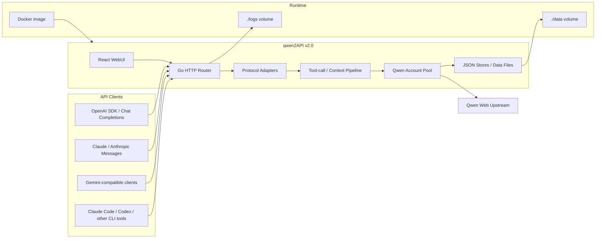

[English](README.md) | [简体中文](README_CN.md)

<div align="center">
  <a href="https://github.com/YuJunZhiXue/qwen2API">
    
  </a>

  <h1>qwen2API</h1>

  <p>
    自托管千问 Web 协议转换网关，提供 OpenAI、Anthropic、Gemini 兼容接口。
  </p>

  <p>
    <a href="https://github.com/YuJunZhiXue/qwen2API">GitHub</a> ·
    <a href="https://hub.docker.com/r/yujunzhixue/qwen2api">Docker Hub</a> ·
    <a href="https://t.me/qwen2api">Telegram</a> ·
    <a href="./README.md">English README</a>
  </p>

  <p>
    <a href="https://github.com/YuJunZhiXue/qwen2API/releases">
      
    </a>
    <a href="https://github.com/YuJunZhiXue/qwen2API/stargazers">
      
    </a>
    <a href="https://hub.docker.com/r/yujunzhixue/qwen2api">
      
    </a>
    
    
    
  </p>
</div>

## 一、项目简介

qwen2API 将千问 Web 能力转换为常见 API 协议，并提供本地 WebUI，用于管理上游账号、下游 API Key、运行配置、模型测试、图片测试和视频测试。

> [!NOTE]
> `v1.0` 是旧版 Python + FastAPI 实现，仅作为历史版本说明保留。`v2.0` 是当前主线，采用 Go 后端 + React WebUI，也是推荐的 Docker 与本地部署版本。

### 1. 功能概览

| 模块 | 能力 |
| --- | --- |
| OpenAI 兼容接口 | `/v1/chat/completions`、`/v1/responses`、`/v1/models`、`/v1/files`、`/v1/images/generations`、`/v1/videos/generations` |
| Anthropic 兼容接口 | `/v1/messages`、`/anthropic/v1/messages`、`/v1/messages/count_tokens` |
| Gemini 兼容接口 | `/v1beta/models/{model}:generateContent`、`/v1beta/models/{model}:streamGenerateContent` |
| WebUI | 账号管理、API Key 管理、运行配置、对话测试、图片测试、视频测试 |
| 账号池 | 多账号轮询、单账号并发控制、对话/图片/视频分用途冷却记录 |
| 运维接口 | `/healthz`、`/readyz`、`/keepalive`、Docker Healthcheck、多架构镜像发布 |

### 2. 版本说明

| 版本 | 技术栈 | 状态 |
| --- | --- | --- |
| `v1.0` | Python + FastAPI/Uvicorn | 旧版实现，仅保留历史说明 |
| `v2.0` | Go 后端 + React WebUI | 当前主线 |

## 二、快速部署

### 1. Docker Hub 拉取部署

大多数情况下，直接用 Docker Hub 镜像就够了。把 `data` 和 `logs` 放在 compose 文件旁边，Docker 会把它们挂载进容器；以后更新镜像时，账号、Key 和日志都还在。

```bash
mkdir qwen2api
cd qwen2api
mkdir -p data logs
```

创建一个简单的 `.env`：

```env
HOST_PORT=7860
HOST_DATA_DIR=./data
HOST_LOGS_DIR=./logs
ADMIN_KEY=replace-with-your-own-strong-random-key
```

创建 `docker-compose.yml`：

```yaml
services:
  qwen2api:
    image: ${QWEN2API_IMAGE:-yujunzhixue/qwen2api:latest}
    container_name: qwen2api
    restart: unless-stopped
    init: true
    env_file:
      - .env
    ports:
      - "${HOST_PORT:-7860}:${PORT:-7860}"
    volumes:
      - ${HOST_DATA_DIR:-./data}:/app/data
      - ${HOST_LOGS_DIR:-./logs}:/app/logs
    shm_size: "512m"
    healthcheck:
      test: ["CMD-SHELL", "curl -fsS http://127.0.0.1:${PORT:-7860}/healthz || exit 1"]
      interval: 30s
      timeout: 10s
      start_period: 120s
      retries: 3
```

不用手动配置 `accounts.json`、`api_keys.json` 这类内部文件路径。镜像里默认就是 `/app/data` 和 `/app/logs`，上面的 volume 映射决定它们最终落在宿主机哪个目录。

拉取并启动：

```bash
docker compose pull
docker compose up -d
docker compose logs -f qwen2api
```

访问地址：

- WebUI：`http://127.0.0.1:7860`
- 健康检查：`http://127.0.0.1:7860/healthz`
- 保活探针：`http://127.0.0.1:7860/keepalive`

### 2. 本地 Docker 编译

当你修改了源码并需要构建自己的镜像时，使用本地 Docker 编译方式。

```bash
git clone https://github.com/YuJunZhiXue/qwen2API.git
cd qwen2API
cp .env.example .env
docker compose -f docker-compose.yml -f docker-compose.build.yml build
docker compose -f docker-compose.yml -f docker-compose.build.yml up -d
```

## 三、架构与配置

### 1. 运行架构



### 2. 环境变量

不要提交真实密钥。`.env.example` 只保留空值和注释示例。

| 变量 | 说明 |
| --- | --- |
| `ADMIN_KEY` | WebUI 和 `/api/admin/*` 管理接口 Key，请自行设置强随机值 |
| `QWEN_API_KEY`、`QWEN_API_KEYS`、`QWEN_API_KEY_N` | 环境变量注入的下游 API Key，仅运行时存在，不写入 `data/api_keys.json`，不能从 WebUI 删除 |
| `QWEN_ACCOUNT_N` | 环境变量注入的上游账号，格式为 `token;optional-email;optional-password`，不写入 `data/accounts.json` |
| `KEEPALIVE_URL`、`KEEPALIVE_INTERVAL` | 可选后台保活任务；环境变量存在时会锁定 WebUI 中对应配置 |
| `TOOL_RECOVERY_MAX_ATTEMPTS` | 工具结果之后上游没有产出下一次客户端工具调用时的自动恢复尝试次数；默认 `4`，限制在 `1`-`8` |
| `HOST_DATA_DIR`、`HOST_LOGS_DIR` | Docker 宿主机挂载路径，默认 `./data` 和 `./logs` |
| `DATA_DIR`、`LOGS_DIR` | 本地非 Docker 路径覆盖；留空时使用当前项目目录 |

## 四、开发指南

### 1. 环境要求

- **Go**: `1.26`
- **Node.js**: `20+`
- **npm**: 随 Node.js 安装
- **Docker**: 仅在需要容器构建或容器部署时使用

### 2. 本地开发

```bash
# 1. 克隆项目
git clone https://github.com/YuJunZhiXue/qwen2API.git
cd qwen2API

# 2. 安装前端依赖
cd frontend
npm ci
cd ..

# 3. 一键启动 Go 后端和 React WebUI
go run start-all.go
```

### 3. 启动与验证

1. 访问 WebUI：`http://127.0.0.1:7860`
2. 检查健康状态：`http://127.0.0.1:7860/healthz`
3. 检查保活探针：`http://127.0.0.1:7860/keepalive`
4. 修改后端代码后执行：

```powershell
cd backend
go test ./...
go build -trimpath -ldflags="-s -w" -o ..\bin\qwen2api-backend.exe .
```

5. 修改前端代码后执行：

```powershell
cd frontend
npm run build
```

### 4. Docker 本地调试

```bash
# 使用本地源码构建镜像
docker compose -f docker-compose.yml -f docker-compose.build.yml build

# 使用本地镜像启动
docker compose -f docker-compose.yml -f docker-compose.build.yml up -d

# 查看日志
docker compose logs -f qwen2api
```

### 5. 开发规范

- 🧩 **模块化开发**: 协议适配、账号池、文件上下文、图片/视频能力和 WebUI 组件应保持边界清晰。
- 🔄 **提交流程**: 小步修改 → 本地验证 → 提交 PR，避免把无关清理、功能改动和格式化混在一起。
- 📚 **文档更新**: 新增用户可见配置、Docker 参数、接口能力或部署方式时，同步更新 README 和 `.env.example`。
- 🔐 **安全边界**: 不要提交 `data/`、`logs/`、`.env`、真实 token、Cookie、密码或下游 API Key。
- 🐳 **Docker 规则**: 容器内部数据路径固定为 `/app/data` 和 `/app/logs`，宿主机路径只通过 compose volume 映射控制。

## 五、参与贡献

### 1. 贡献方式

- 🐛 [报告 Bug](https://github.com/YuJunZhiXue/qwen2API/issues)
- 💡 [功能建议](https://github.com/YuJunZhiXue/qwen2API/issues)
- 🔧 [提交代码](https://github.com/YuJunZhiXue/qwen2API/pulls)
- 💬 [Telegram 交流](https://t.me/qwen2api)

### 2. 贡献列表

感谢所有帮助改进 qwen2API 的贡献者。

[](https://github.com/YuJunZhiXue/qwen2API/graphs/contributors)

## 六、其他信息

### 1. Star History

[](https://www.star-history.com/#YuJunZhiXue/qwen2API&Timeline)

### 2. 开源协议

本项目采用 [GPL-3.0 License](./LICENSE) 开源协议。

**您可以自由地：**

- ✅ 使用、复制、修改和分发本软件。
- ✅ 用于个人、自托管或商业场景。
- ✅ 在遵循 GPL-3.0 的前提下发布修改版本。

**但需要：**

- 📋 保留原始版权声明和开源协议。
- 📋 标明对原始代码的修改。
- 📋 分发衍生作品时遵循 GPL-3.0 的开源要求。

### 3. 免责声明

- 本项目为**免费开源**项目，不保证绝对完善无误。
- 本项目是自托管协议转换网关，请自行评估部署环境、账号风险和使用方式。
- 使用前请自行确认所在地法律、平台规则和上游账号政策。
- 严禁公开泄露真实账号 token、Cookie、密码或下游 API Key。
- 如发现安全问题，请优先通过私密渠道反馈，避免公开敏感信息。

### 4. 特别鸣谢

- 特别鸣谢: [LinuxDo](https://linux.do/)

---

<div align="center">
  <p>如果 qwen2API 对你有帮助，可以考虑给项目一个 Star。</p>
  <p>由 <a href="https://github.com/YuJunZhiXue">YuJunZhiXue</a> 和贡献者共同维护。</p>
</div>
